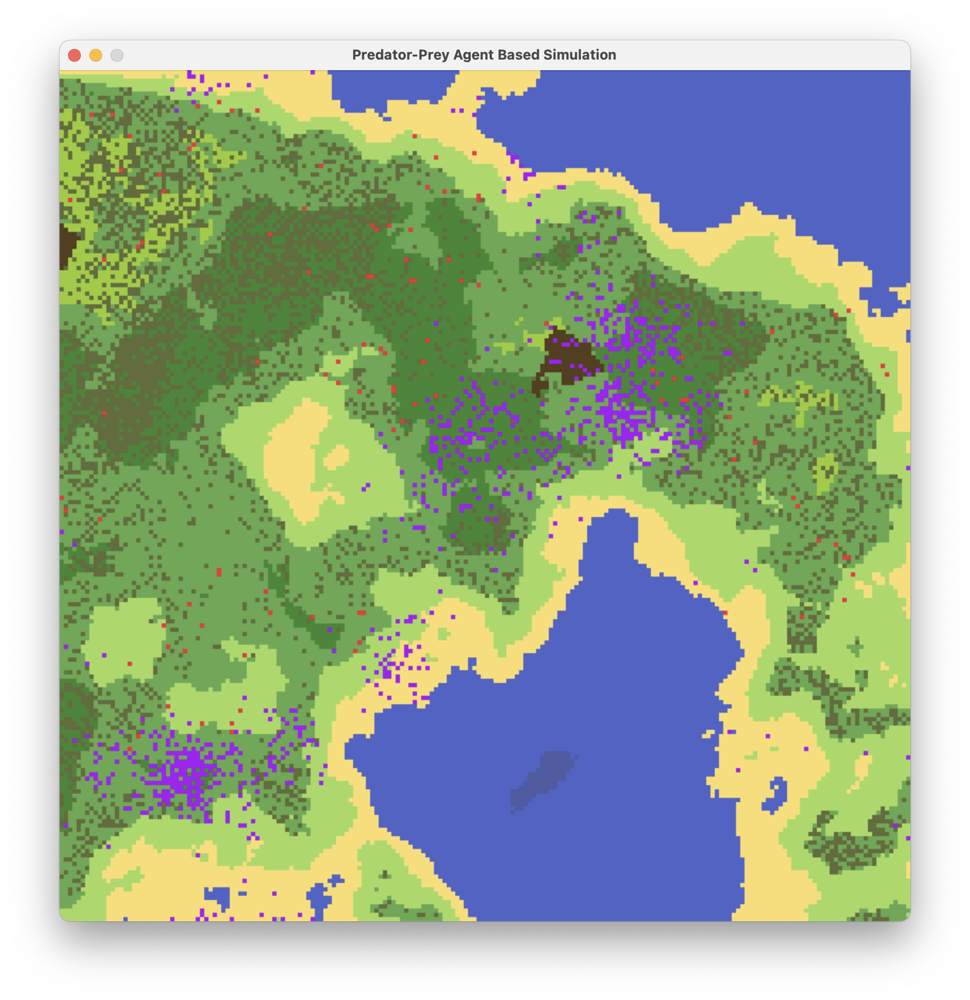
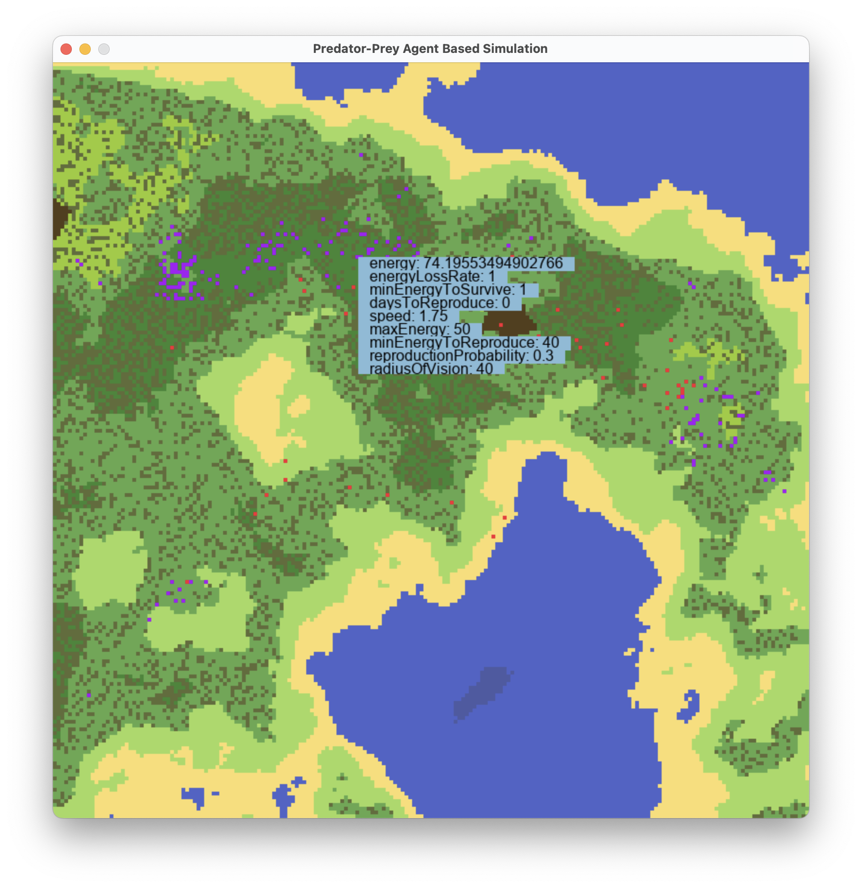
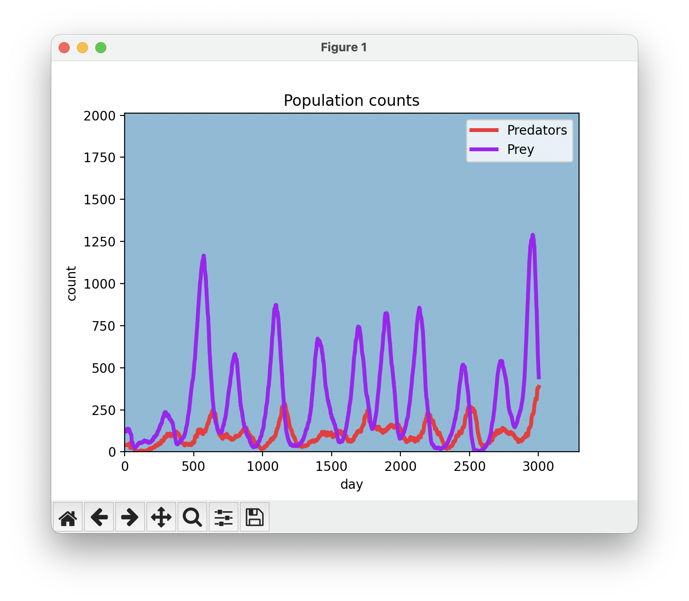

# Predator-Prey agent based model and simulation

## Description

Predator-prey models play a crucial role in understanding the dynamics of bio- and ecosystems, where the growth of different life forms is linked to the availability of resources. In this complex system, various species engage in constant competition, evolution and movement, all driven by the fundamental need for resources necessary for their survival.

The implemented agent-based model is a basis for the following predator-prey simulation. The simulation unfolds as follows: each individual starts with a certain amount of energy, which diminishes with each passing day, but can be replenished through feeding. Predators consume prey, while prey feed on growing grass. Additionally, each species reproduces under favorable conditions. Predators hunt for prey within their field of vision, while prey escapes in similarly defined situations. The behavior of the species in the ultimate model aligns with expectations, depicting the Lotka-Volterra-like dynamics.

## Technologies

* Python 3.11
* pygame
* Matplotlib

## Results

